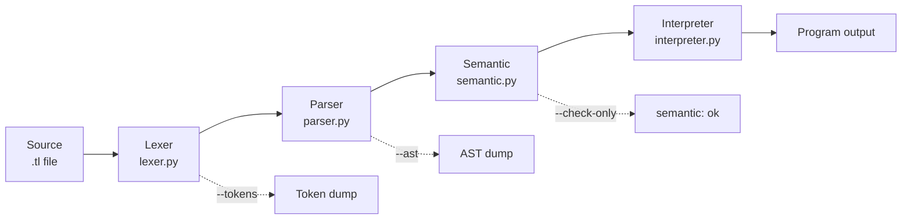

# ToyLang

A toy-language front end and tree-walking interpreter written in pure Python -- lexer, parser, semantic checker, and interpreter in ~600 lines.


## Quick Look

```text
/* precedence.tl */
var x;
x = 3 - -2 * (4 + 1);
output x;
```

```
$ ./main.py examples/precedence.tl
13
```

## Pipeline



## CLI Usage

| Command | Description |
| --- | --- |
| `./main.py file.tl` | Run a program |
| `./main.py file.tl --tokens` | Print the token stream |
| `./main.py file.tl --ast` | Print the AST |
| `./main.py file.tl --check-only` | Lex + parse + semantic check, no execution |
| `python3 -m unittest discover -v` | Run all tests |

> Use `python3 main.py` if `./main.py` lacks executable permission.

## Website And Vercel

The repository includes a static browser playground in `website/`.

### Run locally

```bash
python3 -m http.server 4173 --directory website
```

Then open `http://localhost:4173`.

### Deploy with Vercel CLI

Install the CLI once on the machine:

```bash
npm install -g vercel --prefix "$HOME/.local"
```

Log in and link the static site directory:

```bash
vercel login
vercel --cwd website
```

After the first link, future deployments can be done with:

```bash
vercel --cwd website
vercel --prod --cwd website
```

## Project Structure

```
pl-final-project/
├── main.py                  # CLI entry point
├── toy_lang/
│   ├── tokens.py            # Token types & Token dataclass
│   ├── lexer.py             # Source text -> tokens
│   ├── nodes.py             # AST node dataclasses
│   ├── parser.py            # Tokens -> AST (recursive descent)
│   ├── semantic.py          # Declaration & use-before-decl checks
│   ├── interpreter.py       # AST tree-walking interpreter
│   ├── formatters.py        # Pretty-printers for tokens & AST
│   └── errors.py            # Shared error types
├── tests/
│   ├── test_lexer.py
│   ├── test_parser.py
│   ├── test_semantic.py
│   ├── test_interpreter.py
│   ├── test_cli.py
│   └── test_examples.py     # End-to-end on every examples/*.tl
└── examples/
    ├── basic.tl
    ├── comments.tl
    ├── multiline_comments.tl
    ├── precedence.tl
    ├── input_output.tl
    ├── invalid_identifier.tl
    ├── invalid_semantic.tl
    └── invalid_syntax.tl
```

<details>
<summary><strong>Grammar</strong></summary>

### Supported statements

- `var IDENT;` -- declare a variable (initialized to `0`)
- `IDENT = expr;` -- assignment
- `input IDENT;` -- read an integer from stdin
- `output IDENT;` -- print a variable's value

### Expression grammar

```text
program    := statement* EOF
statement  := "var" IDENT ";"
           | IDENT "=" expr ";"
           | "input" IDENT ";"
           | "output" IDENT ";"
expr       := term (("+" | "-") term)*
term       := unary (("*" | "/") unary)*
unary      := "-" unary | primary
primary    := INT | IDENT | "(" expr ")"
```

### Token categories

| Category | Examples |
| --- | --- |
| Keywords | `var`, `input`, `output` |
| Identifiers | ASCII letters, digits, `_` (cannot start with a digit) |
| Integers | Decimal integer literals |
| Operators | `+` `-` `*` `/` `=` |
| Delimiters | `(` `)` `;` |
| Comments | `/* ... */` (block only, non-nesting) |

</details>

## Sample Programs

| File | What it shows |
| --- | --- |
| `basic.tl` | Arithmetic and output |
| `comments.tl` | Block comments and precedence |
| `multiline_comments.tl` | Multi-line block comments |
| `precedence.tl` | Nested unary minus and parentheses |
| `input_output.tl` | Console input and output |
| `invalid_identifier.tl` | Lexer error: non-ASCII identifier |
| `invalid_semantic.tl` | Semantic error: use before declaration |
| `invalid_syntax.tl` | Parser error: missing semicolon |

## Verified Results

| Case | Command | Expected | Actual |
| --- | --- | --- | --- |
| Basic execution | `./main.py examples/basic.tl` | `14` | `14` |
| Comment handling | `./main.py examples/comments.tl` | `4` | `4` |
| Multi-line comments | `./main.py examples/multiline_comments.tl` | `8` | `8` |
| Unary minus & precedence | `./main.py examples/precedence.tl` | `13` | `13` |
| Semantic-only mode | `./main.py examples/basic.tl --check-only` | `semantic: ok` | `semantic: ok` |
| Runtime input | `printf '7\n' \| ./main.py examples/input_output.tl` | `number = 14` | `number = 14` |
| Lexer failure | `./main.py examples/invalid_identifier.tl` | `lexer: 1:8: invalid character 'é'` | `lexer: 1:8: invalid character 'é'` |
| Semantic failure | `./main.py examples/invalid_semantic.tl` | `semantic: 1:8: variable 'x' used before declaration` | `semantic: 1:8: variable 'x' used before declaration` |
| Syntax failure | `./main.py examples/invalid_syntax.tl` | `parser: 2:1: expected ';' after variable declaration` | `parser: 2:1: expected ';' after variable declaration` |

## References

- Aho, A. V., Lam, M. S., Sethi, R., and Ullman, J. D. *Compilers: Principles, Techniques, and Tools* (2nd ed.).
- Python [`dataclasses`](https://docs.python.org/3/library/dataclasses.html), [`argparse`](https://docs.python.org/3/library/argparse.html), [`unittest`](https://docs.python.org/3/library/unittest.html), [built-in I/O functions](https://docs.python.org/3/library/functions.html)
- [LLVM frontend tutorial](https://llvm.org/docs/tutorial/MyFirstLanguageFrontend/index.html)
